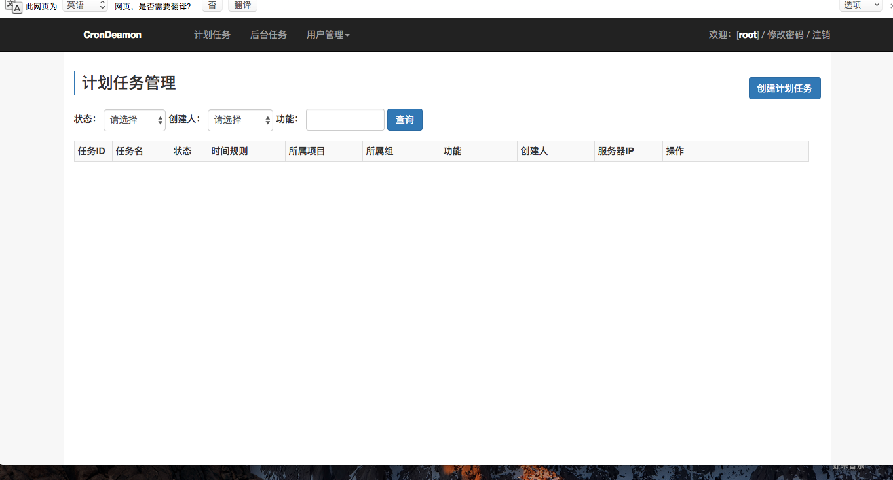
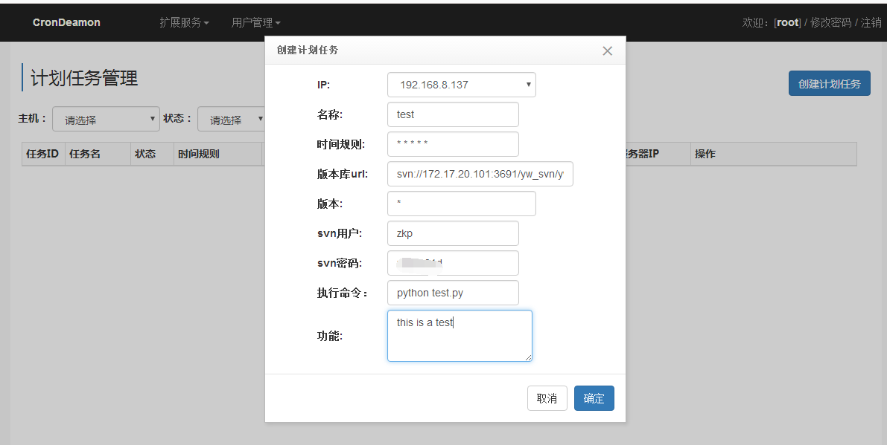

============
crondeamon
============
***************
1.介绍
***************
crondeamon是用来通过web管理计划任务及后台任务的项目， 其功能相当于supervisor+crontab，  基于twisted   django 框架。通过crondeamon可以在web页面中完成计划任务或后台任务的管理。本项目源于世界工厂网研发团队,现仍在项目中服役.

***************
2.依赖
***************
python版本要求：

python>=2.6.x 

pip   svn

***************
3.安装
***************
本项目已提交到python官方源，可以直接通过pip或easy_install进行安装

pip install crondeamon 或 easy_install crondeamon

***************
4.配置详解
***************

配置文件：  /etc/crondeamon.ini
::

  [crondeamon]
  mysqlhost=192.168.15.34        ; mysql IP
  mysqlport=3306                 ; mysql 端口
  mysqldb=mycrondeamon           ; mysql 数据库名
  user=root                      ; mysql 用户名
  passwd=123456                  ; mysql 密码
  charset=utf8                   ; mysql 编码 ，最好设为为utf8
  host=192.168.8.137             ; 服务绑定的IP,默认为 0.0.0.0
  datadir=/data/test/crondeamon  ; 服务data目录

注： web管理页面的默认账户是root，密码123456,本服务需要占用8023端口(内部模块通信)和8024端口(web UI)

***************
5.运行和停止
***************

运行：python -m crondeamon.sbin.main -c start

停止：python -m crondeamon.sbin.main -c stop

重启：python -m crondeamon.sbin.main -c restart

***************
6.例子
***************

以192.168.8.137机器为例：
 ::

  [root@bogon ~]# pip install crondeamon
  DEPRECATION: Python 2.6 is no longer supported by the Python core team, please upgrade your Python. A future version of pip will drop support for Python 2.6
  Collecting crondeamon
  Installing collected packages: crondeamon
  Running setup.py install for crondeamon ... done
  Successfully installed crondeamon-0.1.2

  [root@bogon ~]# vim /etc/crondeamon.ini
  [crondeamon]
  mysqlhost=192.168.15.34
  mysqlport=3306
  mysqldb=mycrondeamon
  user=root
  passwd=123456
  charset=utf8
  datadir=/data/test/crondeamon

  [root@bogon ~]# python -m crondeamon.sbin.main -c start
  start success!
安装成功，打开http://192.168.8.137:8024

用默认账号密码 root    123456 进行登陆，并新建一个计划任务

创建完成

.. image:: docs/image/ex3.png

如有问题可以QQ联系:  943489924