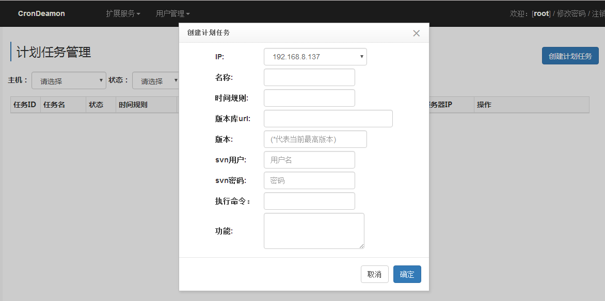

============
crondeamon
============
***************
1.介绍
***************
crondeamon是用来管理计划任务及后台任务的项目， 其功能相当于supervisor+crontab，  基于twisted   django 框架。通过crondeamon可以在web页面中完成计划任务或后台任务的管理。

***************
2.依赖
***************
python版本要求：

python>=2.6.x 

pip   svn   git

***************
3.安装
***************
pip install crondeamon

***************
4.配置详解
***************
配置文件：  /etc/crondeamon.ini
[crondeamon]
mysqlhost=192.168.15.34        # mysql IP
mysqlport=3306                 # mysql 端口
mysqldb=mycrondeamon           # mysql 数据库名
user=root                      # mysql 用户名
passwd=123456                  # mysql 密码
charset=utf8                   # mysql 编码 ，最好设为为utf8
host=192.168.8.137             # 服务绑定的IP
datadir=/data/test/crondeamon  # 服务data目录
slaveport=8023                 # 服务中slave模块绑定端口
uiport=8024                    # 服务中ui模块绑定端口, 安装完成后可通过192.168.8.137:8024打开web管理页面

***************
5.运行
***************

以192.168.8.137机器为例：
 ::

  [root@bogon ~]# pip install crondeamon
  DEPRECATION: Python 2.6 is no longer supported by the Python core team, please upgrade your Python. A future version of pip will drop support for Python 2.6
  Collecting crondeamon
  Installing collected packages: crondeamon
  Running setup.py install for crondeamon ... done
  Successfully installed crondeamon-0.1.2

  [root@bogon ~]# vim /etc/crondeamon.ini
  [crondeamon]
  mysqlhost=192.168.15.34
  mysqlport=3306
  mysqldb=mycrondeamon
  user=root
  passwd=123456
  charset=utf8
  host=192.168.8.137
  datadir=/data/test/crondeamon
  slaveport=8023
  uiport=8024

  [root@bogon ~]# python -m crondeamon.sbin.main -c start
  start success!

192.168.8.95:
::

  [root@hadoop95 ~]# pip install  git+git://github.com/zhoukunpeng504/crondeamon.git
  [root@hadoop95 ~]# mkdir /etc/crondeamon
  [root@hadoop95 ~]# vim  /etc/crondeamon/slave.ini
  [crondeamon]
  host=192.168.8.95                                                                                                        
  mysqlhost = 192.168.15.34
  mysqlport = 3306
  mysqldb = crondeamon
  user = zhou
  passwd = zhou
  charset = utf8 
  [root@hadoop95 ~]# python -m crondeamon.sbin.slave -c start
  start success!
192.168.8.96:
 ::

  [root@hadoop96 ~]# pip install  git+git://github.com/zhoukunpeng504/crondeamon.git
  [root@hadoop96 ~]# vim /etc/crondeamon/slave.ini

  [crondeamon]
  host=192.168.8.96                                                                                                        
  mysqlhost = 192.168.15.34
  mysqlport = 3306
  mysqldb = crondeamon
  user = zhou
  passwd = zhou
  charset = utf8
  [root@hadoop96 ~]# python -m crondeamon.sbin.slave -c start 

master安装：
192.168.8.94
 ::

  [root@hadoop94 /]# vim /etc/crondeamon/master.ini
  [crondeamon]
  host=192.168.8.94
  mysqlhost = 192.168.15.34
  mysqlport = 3306
  mysqldb = crondeamon
  user = zhou
  passwd = zhou
  charset = utf8
  [root@hadoop94 /]# python -m crondeamon.sbin.master -c start
  start success!
ui安装：
ui部分是基于django的，第一次启动ui时需要先syncdb，   syncdb过程中需要创建一个超级用户， 按照提示输入即可，该用户用于第一次登录系统。

192.168.8.94
 ::

  [root@hadoop94 /]# python -m crondeamon.ui.cap.manage  syncdb 
  [root@hadoop94 /]# python -m crondeamon.ui.cap.manage  runserver   0.0.0.0:8035
  Validating models...

  0 errors found
  Django version 1.4.16, using settings 'cap.settings'
  Development server is running at http://0.0.0.0:8035/
  Quit the server with CONTROL-C.
  
  